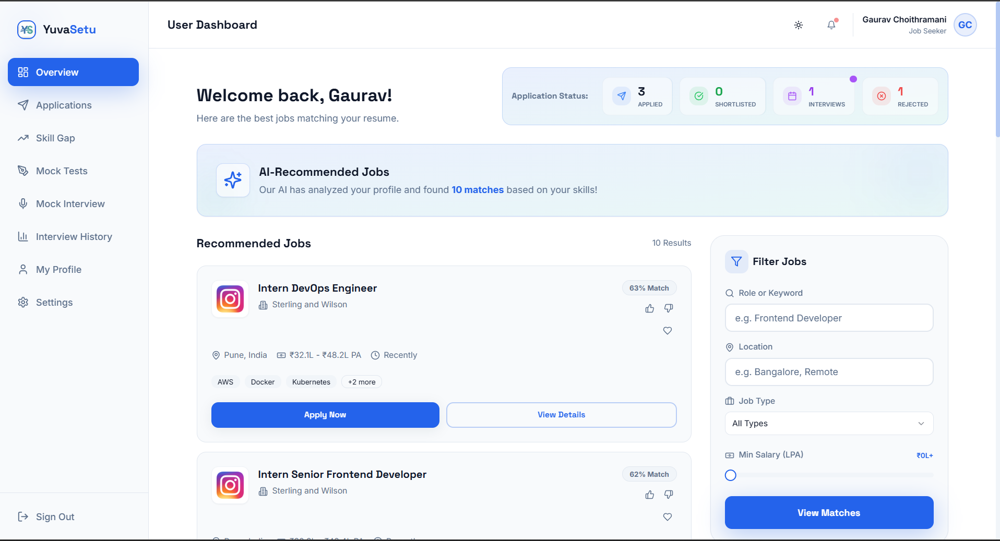
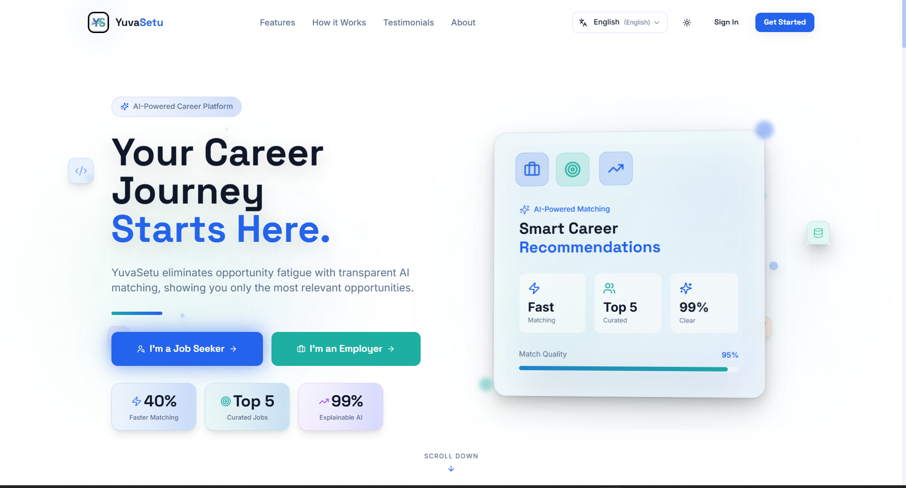
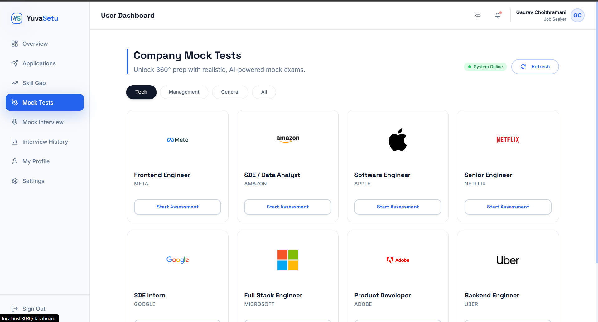
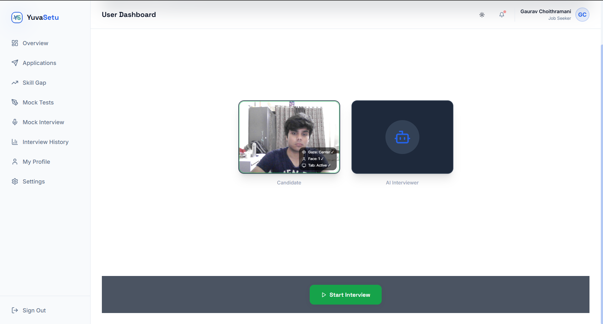
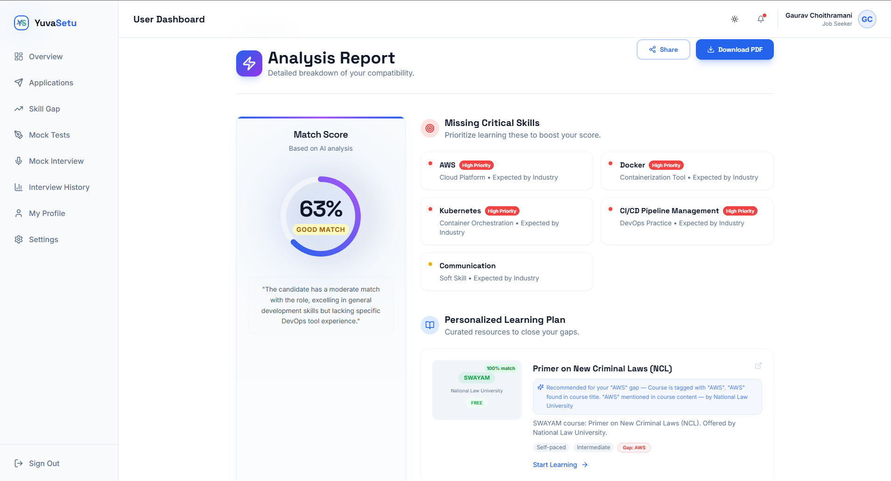

# YuvaSetu – AI Powered Career Platform

An AI-powered career platform designed to improve job discovery and interview preparation using modern AI technologies like embeddings, large language models, and speech processing.

---

## Live Links

Demo: Coming Soon  
Report Bug: Open an issue  
Request Feature: Open an issue  

---

## About The Project

YuvaSetu solves the problem of irrelevant job search results and lack of interview preparation by combining AI-based semantic matching with voice-based mock interviews.

Instead of traditional keyword matching, the platform understands the meaning of skills and experience using embeddings, ensuring better job recommendations. The integrated AI mock interviewer helps users practice interviews and receive feedback on multiple performance parameters.

---

## Screenshots

### Home Page

### Login Page

### Mock Test Page

### AI Mock Interview

### Skill Gap Analysis

---

## Key Features

• Semantic job matching using vector embeddings  
• Voice-based AI mock interview (Speech-to-Text → LLM → Text-to-Speech)  
• Resume parsing using AI  
• Skill gap analysis with course recommendations  
• GitHub profile integration for automatic project summaries  
• Multilingual support (English, Hindi, Marathi)  
• Company-specific mock tests  
• Real-time interview feedback scoring  
• Employer dashboard for job posting and candidate discovery  

---

## Tech Stack

### Frontend

* React.js
* TypeScript
* Tailwind CSS
* React Router

### Backend

* Node.js
* Express.js
* Mongoose

### Database

* MongoDB Atlas

### AI / ML

* Google Gemini Embeddings API
* Ollama LLM (gemma, mistral, llama)
* Whisper Speech-to-Text
* Edge Text-to-Speech

### Other Tools

* Socket.io
* Firebase Authentication
* Python Flask (AI microservices)
* GitHub GraphQL API

---

## System Architecture

User Profile → Embeddings → Vector Search → Ranked Job Matches  

Audio Input → Speech-to-Text → LLM Processing → Text-to-Speech → Interview Feedback  

Frontend (React) → Backend (Node.js) → Database (MongoDB) → AI Services  

---

## Getting Started

### 1. Clone the repository

git clone https://github.com/your-username/yuvasetu.git

cd yuvasetu

### 2. Install dependencies

npm install

### 3. Setup environment variables

Create a `.env` file in root folder and add:

GEMINI_API_KEY=your_key  
MONGODB_URI=your_mongodb_url  
JWT_SECRET=your_secret  

### 4. Run the development server

npm run dev  

Open http://localhost:3000 in browser.

---

## Usage

1. Create profile or upload resume  
2. Get AI-powered job recommendations  
3. Practice interviews with AI interviewer  
4. Receive feedback on communication and technical skills  
5. Identify skill gaps and recommended courses  

---

## Future Improvements

• Mobile app version  
• More language support  
• Advanced interview analytics  
• More job sources integration  
• Improved recommendation accuracy  

---

## Contributing

Contributions are welcome.

1. Fork the project  

2. Create feature branch  
git checkout -b feature/AmazingFeature  

3. Commit changes  
git commit -m "Add AmazingFeature"  

4. Push branch  
git push origin feature/AmazingFeature  

5. Open Pull Request  

---

## License

Distributed under the MIT License.

---

## Contributors

| Joy Banerjee |
| Shubham Kumar |
| Atharva Chavan |
| Arjun Verma |
| Anjan Thakur |
| Gaurav Choithramani |
